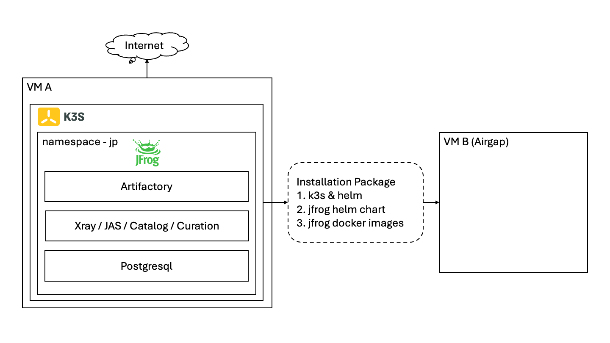

# JFrog-Platform-k3s-installation / kfs

kfs = k3s + jfrog platform

## Problems

1. More and more components(e.g. Artifactory, Xray, JAS) are increasingly complex to install separately, while k3s + jfrog platform is simple
2. k3s + jfrog platform installation requires many docker images, and the customer environment may be airgap
3. Airgap is not only troublesome to install, but also troublesome to activate offline and configure demo

## Goals

1. It allows you to easily simulate an airgap installation in your own environment to ensure that everything goes well with a specific chart version
2. Installation can be as simple as copying a single file into the airgap environment
3. Even all the demo configurations made in your simulated installation environment can be preserved

## Architecture

## Supported Systems

1. jfrog supported system = e.g. RHEL 8.x, 9.x

        https://jfrog.com/help/r/jfrog-installation-setup-documentation/requirements-matrix

2. jfrog supported k3s

        https://jfrog.com/help/r/jfrog-installation-setup-documentation/k3s-installer-system-requirements
        
        e.g.
        v1.25.14

3. k3s supported system

        https://www.suse.com/suse-k3s/support-matrix/all-supported-versions/k3s-v1-24/
        
        e.g.
        v1.25.14 = RHEL 8.5 ~ 8.8

4. this project supported k3s

        check ./version.json
        
        e.g. 
        v1.24.10 = RHEL 8.4 ~ 8.6
        v1.25.14 = RHEL 8.5 ~ 8.8
        v1.27.16 = RHEL 8.7 ~ 9.4

        | Simulated installation environment (non-airgap) | Target installation environment (airgap) | Support |

        |-------------------------------------------------|------------------------------------------|---------|

        | CentOS 7.9, 4C8G, 40GB                          | CentOS 7.9, 4C8G, 40GB                  | Y       |

        | CentOS 7.9, 4C8G, 40GB                          | Redhat 8.8, 4C8G, 40GB                  | Y       |

        | CentOS 7.9, 4C8G, 40GB                          | Ubuntu 22.04, 4C8G, 40GB                | Y       |

        https://www.tablesgenerator.com/markdown_tables

## Resource Requirements

        | Components to be tested                             | Required Resources | Disk |
        |-----------------------------------------------------|--------------------|------|
        | Artifactory                                         | 4C8G               | 40G  |
        | Artifactory + Security (Xray/JAS/...) - Minimum     | 8C16G              | 300G |
        | Artifactory + Security (Xray/JAS/...) - Recommended | 16C32G             | 500G |

## Start Installation

### 1. Enter the simulated installation environment (non-airgap)   

1.1 Uninstall Docker

        k3s comes with its own Containerd, if you have Docker & Containerd install, uninstall them

        ./uninstall-docker.sh

1.2 Check & update version of jfrog helm chart

        vi ./version.json

        e.g. 
        "ENABLED": true,
        ...
        "xxx_VERSION": "x.x.x"
        
        check all releases here - https://jfrog.com/download-legacy/?product=platform

        1. Product - Select Platform / Artifactory / Xray
        2. Version - Select x.x.x (this is Helm Chart Version)
        3. Check https://charts.jfrog.io/ - search x.x.x
        download it, check Artifactory version in Chart.yaml

1.3 Install

        ⚠️ Important
        Please execute these scripts in a path with sufficient disk space. 
        The data of running k3s will be stored in the ./k3s-data-dir directory.
        The imported Xray vulnerability database will occupy about 100GB~200GB.

        ./1-download.sh

                This step will check if the packages have been downloaded, if not, download them (k3s, helm, jfrog helm chart).

                And copy the downloaded package to the directory waiting to be installed

        ./2-install-k3s.sh

                If there are any errors, you can check the status with this command

                systemctl status k3s

        ./3-install-xxx.sh
        
                - by default, an internal database will be created in the same namespace
                ./3-install-jfrog-platform.sh
                
                - to use an external database, you can
                1. use ./pg-install.sh, ./pg-create-db.sh to create a database in another namespace
                2. check $DOWNLOAD_DIR_JFROG/custom/external-pg.yaml
                3. set the environment variables PG_HOST and KFS_PASSWORD
                4. ./3-install-jfrog-platform.sh

                OR

                ./3-install-art.sh
                ./3-install-xray.sh

                This is how we can accurately parse the required jfrog docker images.

        ./4-check-and-listen.sh

                You can execute this script repeatedly to see its startup status. It usually takes several minutes until all pods become running.

        ./4.1-pull-upgrade-check-image.sh

                ⚠️ Important
                Update & execute this script, this will ensure that you do not lose this image later when you package the installation package and perform the upgrade in an isolated environment, because during the upgrade it will try to pull a new Docker image to perform pre-upgrade checks. 

        ./5-package.sh

                ⚠️ Important
                When you perform this step:

                First, you will choose to export jfrog docker images(about 2.9GB) for subsequent installation in the airgap environment.

                Then, it will ask you whether to include k3s_data_dir(about 11GB) in the package.

                The benefit of including it is that all the demo configurations you make in the simulation environment will be retained in the airgap environment.

 

1.4 Offline Activation of JFrog in an Air-gapped Environment

        https://jfrog.com/help/r/jfrog-installation-setup-documentation/configure-jfrog-platform-in-an-air-gapped-environment

        ⚠️ Important
        In this document, the first step is to change the Artifactory System YAML file.
        
        There are several ways to make changes:
        1. By configuring custom-values.yaml (the best way)

                ls ./download/jfrog/custom/custom-values.yaml
                check extraSystemYaml in it
   
                it will merge with ./download/jfrog/jfrog-platform/charts/artifactory/files/system.yaml
                
                if update the source file
                tar -czf jfrog-platform-x.x.x.tgz jfrog-platform

        2. By temporary direct changes to files
        
                1. check ./login-art-pod.sh
                2. after the changes, restart Artifactory by deleting pod of Artifactory

1.5 Xray DB Sync
        
        https://jfrog.com/help/r/jfrog-security-user-guide/products/xray/xray-management/xray-and-jfrog-external-db-sync

        When clicking the Sync button, please observe the xray log first.
        ./check-xray-log.sh

### 2. Enter the target installation environment (airgap) 

2.1 Uninstall Docker

        k3s comes with its own Containerd, if you have Docker & Containerd install, uninstall them

        ./uninstall-docker.sh

2.2 Copy

        Copy the single package to the airgap environment, unpack it, and execute the scripts in sequence again to install it.

2.3 Install

        ⚠️ Important
        Please execute these scripts in a path with sufficient disk space. 
        The data of running k3s will be stored in the ./k3s-data-dir directory.
        The Imported Xray vulnerability database will occupy about 100GB~200GB.
        
        ./1-download.sh

                This step will copy the downloaded package to the directory waiting to be installed

 

        ./2-install-k3s.sh

 

        ./3-install-xxx.sh
        
                - by default, an internal database will be created in the same namespace
                ./3-install-jfrog-platform.sh
                
                - to use an external database, you can
                1. use ./pg-install.sh, ./pg-create-db.sh to create a database in another namespace
                2. check $DOWNLOAD_DIR_JFROG/custom/external-pg.yaml
                3. set the environment variables PG_HOST and KFS_PASSWORD
                4. ./3-install-jfrog-platform.sh

                OR
                
                ./3-install-art.sh
                ./3-install-xray.sh

                If you have included k3s_data_dir in your package, you don't need to perform this step.

 

        ./4-check-and-listen.sh

 

## Trouble shooting
### Xray db sync pending

- Delete the content of the update_state table 

        ./login-pg-pod.sh

        I have no name!@jfrog-platform-postgresql-0:/$ psql -U xray
        Password for user xray: (xray)
        psql (16.6)
        Type "help" for help.

        delete from updates_state;
        exit;

- Restart Xray

        ./restart-xray.sh

- Monitoring the logs for Xray

        ./check-xray-log.sh