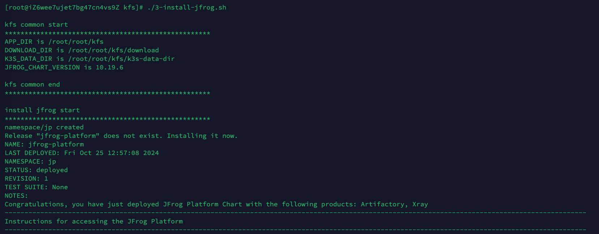

# JFrog-Platform-k3s-installation

## Problems
- Installing individual components like Artifactory, Xray, and JAS can be complex. Using k3s with the JFrog Platform simplifies the process.
- The k3s and JFrog Platform installation requires multiple Docker images, which can complicate air-gapped (offline) installations.
- Air-gapped setups are challenging not only for installation but also for offline activation and demo configuration.

## Objectives
- Simulate an air-gapped installation in a non-air-gapped environment to ensure compatibility with a specific Helm chart version.
- Enable simplified installation in an air-gapped environment by copying a single package.
- Retain all demo configurations from the simulated environment in the final air-gapped setup.

## Guide

1. Enter the simulated installation environment (non-airgap)

        First, check & update version of jfrog platofm's helm chart
        
                vi ./common.sh
                e.g. JFROG_CHART_VERSION=10.19.6, get the latest version number from https://charts.jfrog.io/

        Then, execute the scripts in order.
        ./1-download.sh

                This step will download the packages required to install k3s in the airgap environment.
                It will also download helm and jfrog platform's helm chart.

        ./2-install-k3s.sh
        ./3-install-jfrog.sh

                This is how we can accurately parse the required jfrog docker images.

        ./4-check-and-listen.sh

                You can execute this script repeatedly to see its startup status. It usually takes several minutes until all pods become running.

        ./5-package.sh

                This step is very important. 
                First, you will choose to export jfrog docker images(about 2.9GB) for subsequent installation in the airgap environment.

                Then, it will ask you whether to include k3s_data_dir(about 11GB) in the package.
                The benefit of including it is that all the demo configurations you make in the simulation environment will be retained in the airgap environment.

 

2. Enter the target installation environment (airgap) 

        Copy the single package to the airgap environment, unpack it, and execute the scripts in sequence again to install it.
        
        ./1-download.sh

 

        ./2-install-k3s.sh

 

        ./3-install-jfrog.sh

                If you have included k3s_data_dir in your package, you don't need to perform this step.

                If you execute this script again, it will try to pull 1 more new docker image to perform pre-upgrade checks.
                So if you need to upgrade, please make sure you have simulated the upgrade in the simulation environment and exported this docker image.

 

        ./4-check-and-listen.sh

 

## Verified Supported Systems

1. jfrog supported system = e.g. RHEL 8.x, 9.x
https://jfrog.com/help/r/jfrog-installation-setup-documentation/requirements-matrix

2. jfrog tested k3s = K3s v1.25.14+k3s1 (here tested v1.24)
https://jfrog.com/help/r/jfrog-installation-setup-documentation/k3s-installer-system-requirements

3. k3s v1.24 supported system version = e.g. RHEL 8.5 ~ 8.8
https://www.suse.com/suse-k3s/support-matrix/all-supported-versions/k3s-v1-24/

    
        | Simulated installation environment (non-airgap) | Target installation environment (airgap) | Support |
        |-------------------------------------------------|------------------------------------------|---------|
        | CentOS 7.9, 4C8GB, 40GB                         | CentOS 7.9, 4C8GB, 40GB                  | Y       |
        | CentOS 7.9, 4C8GB, 40GB                         | Redhat 8.8, 4C8GB, 40GB                  | Y       |
        | CentOS 7.9, 4C8GB, 40GB                         | Ubuntu 22.04, 4C8GB, 40GB                | Y       |
        https://www.tablesgenerator.com/markdown_tables

        

